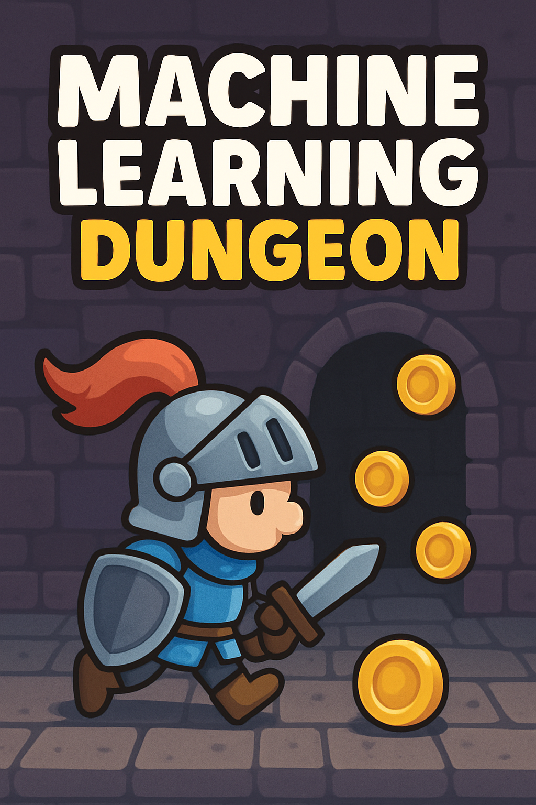

# ML Knight

A software representing a knight that autonomously searches for coins in a dungeon.

## What's this - how it works
This is only an **exercise**. It's a silly implementation of a Machine Learning - [Reinforcement Learning](https://en.wikipedia.org/wiki/Reinforcement_learning) approach. There are tons of improvements and - quite sure - a certain number of errors. But I've got fun coding this

At every move into the dungeon, the knight memorises the state from which it comes (what's around him), the action taken and associates a reward depending on the outcome (the new state reached): hitting a wall, picking a coin, or nothing.

Before the last dungeon, you can make a training session, defining how many training games to play in the background: so a first set of experiences is put in memory, reducing the following error rate.

## How to use
- Compile with `make` or `make debug`
- Enter folder `bin` (or `debug`)
- Run `mlknight [-v] <NUMBER OF TRAINING SESSIONS>`

### Requirements
- `gcc`
- `make`

### Examples:
- `mlknight -v 250`
- `mlknight 400`

## History and background
The first idea came to me a few years ago, while reading "Collected works of A. M. Turing. Mechanical Intelligence" (the [Italian edition](https://www.bollatiboringhieri.it/libri/alan-m-turing-intelligenza-meccanica-9788833908809/)), from where basically we can take the ideas of a machine (a software, in this case) with:
- a state;
- an action to take on that state;
- a memory where to save states and actions.

Every action results in another state.
Starting from this, we add a reward, i.e. a number representing how much the result of the action (the new state) is similar to one of the expected states.

Then I wrote a little Snake-style game following these guidelines: the states are the circumstances (literally!) in which the snake could be, the world around it. Four cells ([Von Neumann's neighborhood](https://en.wikipedia.org/wiki/Von_Neumann_neighborhood)) showing empty, walls, apple, and himself.
When an action is taken (a move in one direction) a reward were assigned to that particular association of state and action and saved into memory so that every next move, if in the same state, were influenced by that previous experience (i.e. reward).

Now it's quite the same, but dungeon-knight-flavoured and with two differences:
- hitting walls does not kill our hero;
- uses a [Moore's neighborhood](https://en.wikipedia.org/wiki/Moore_neighborhood)

Here, we could improve our system by adding different actions (not only moving but also, for example, picking or fighting) and cells (monsters, doors), making things more articulated.

## Next steps
- Insert deadly monster and other things, and more actions to take (fight, open, etc.) 
- Use CUDA for running computationally-heavy tasks on NVidia GPUs
- Remake in GoLang and use goroutines

## License
This project is licensed under the MIT License - see the [LICENSE](LICENSE) file for details.
